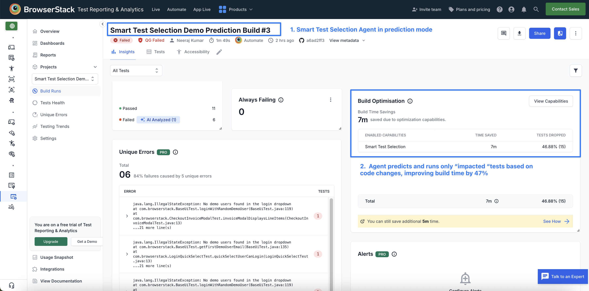

# Smart Test Selection & Orchestration AI Agent Demo for BrowserStack Automate

## Table of Contents
- [What is Smart Test Selection?](#-what-is-smart-test-selection)

- [How Smart Test Selection Agent Works](#how-test-selection-agent-works)

- [Steps to run the demo](#steps-to-run-the-sample-project)

---

## What is Smart Test Selection?
BrowserStack's Smart Test Selection Agent uses AI to identify and run only the tests impacted (or likely to fail) by your code changes, reducing build time and cost by up to 50%. This demo uses the BrowserStack Java SDK with TestNG: 
- App Repo – [test-selection-demo-app-browserstack](https://github.com/browserstack/test-selection-demo-app-browserstack)
- Test Repo – [test-selection-demo-test-browserstack](https://github.com/browserstack/test-selection-demo-test-browserstack)
---

## How Smart Test Selection Agent Works

- Agent learns from historical build runs and associated code changes to predict impacted (or likely to fail) tests for incoming builds.
- It provides two approaches to integrate 
   - Integrate via Github app
   - Cloning the app repo on the test job

For detailed integration steps follow the [Test Selection Documentation](https://www.browserstack.com/docs/automate/selenium/smart-test-selection?fw-lang=java%2Ftestng).

## Steps to run the demo
- This demo showcases BrowserStack’s Smart Test Selection Agent using the **repo-cloning** integration approach. 
- First, we run a build with Smart Test Selection disabled and then run the same build with it enabled, allowing you to clearly see the impact - with Test Selection, only the “likely to fail” tests run based on code changes, resulting in up to 50% reduction in execution time

### Prerequisites
- Java & Maven 3.6+
- Node.js 16+
- BrowserStack Account with AI Enabled: [Activate BrowserStack AI preferences](https://www.browserstack.com/docs/iaam/settings-and-permissions/activate-browserstack-ai)
---

### Step 1: Clone App Repo

```
git clone https://github.com/browserstack/test-selection-demo-app-browserstack.git
cd test-selection-demo-app-browserstack

# Install dependencies
npm install

# For the demo, checkout the feature branch
git checkout demo_app_v2
```

### Step 2: Setup Test Repo

```
# Clone the test repo
git clone https://github.com/browserstack/test-selection-demo-test-browserstack.git
cd test-selection-demo-test-browserstack

# Checkout the TestNG demo branch
git checkout testng-automate

# Build the project (downloads dependencies and skips running tests)
mvn clean install -DskipTests
```  

### Step 3: Add Browserstack Credentials
- Update `username` and `accesskey` in the browserstack.yml file with your BrowserStack access credentials found [here](https://www.browserstack.com/accounts/profile/details)
```
username: <your-browserstack-username>
accessKey: <your-browserstack-accesskey>
```  

### Step 4: Run a build without Smart Test Selection enabled
- In `browserstack.yml`, add projectName, buildName and disable Test Selection
```yaml
projectName: Smart Test Selection Demo Project
buildName: Smart Test Selection Demo Prediction Build

testOrchestrationOptions:
  runSmartSelection:
    enabled: false
    mode: 'relevantOnly'
    # specify absolute or relative paths of locally cloned demo app repo
    # to include multiple app repos, add each as a separate line under source
    source:
      - '<path_to_demo_app_locally_cloned>
    # - '/home/user/smart-test-selection-demo/app-repo-1'
    # - '/home/user/smart-test-selection-demo/app-repo-2'
```

- Run the build with `mvn test` command
- Results:
  - All 32 tests run
  - Execution time reflects a typical non-AI run
  - This is our baseline - the full suite always runs regardless of which parts of the code changed


### Step 5: Run a build with Smart Test Selection enabled
- In `browserstack.yml`, enable Test Selection
 ```yaml
projectName: Smart Test Selection Demo Project
buildName: Smart Test Selection Demo Prediction Build

testOrchestrationOptions:
  runSmartSelection:
    enabled: true
    mode: 'relevantOnly'
    # specify absolute or relative paths of locally cloned demo app repo
    # to include multiple app repos, add each as a separate line under source
    source:
      - '<path_to_demo_app_locally_cloned>
    # - '/home/user/smart-test-selection-demo/app-repo-1'
    # - '/home/user/smart-test-selection-demo/app-repo-2'
```

- Run the build again with `mvn test` command
- Results:
  - Smart Test Selection analyzes the code changes in the demo app
  - It determines which tests are “likely to fail” based on those changes
  - Instead of running all 32 tests, the agent selects and runs only this relevant subset (relevantOnly mode)
  - All other unimpacted tests are automatically skipped/dropped


### Example Results


- Total tests: 17 ‘likely to fail’ tests executed (vs full suite)
- Time saved: ~47% reduction in build time

## Additional Resources
- [Smart Test Selection Documentation](https://www.browserstack.com/docs/automate/selenium/smart-test-selection?fw-lang=java) - Learn more about how Smart Test Selection works
