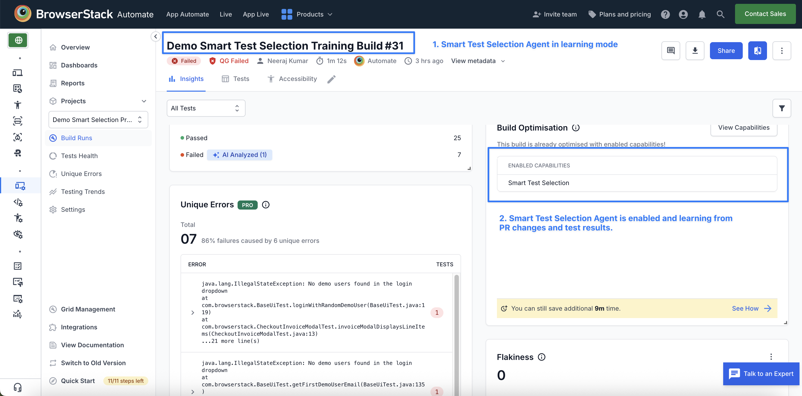

# Smart Test Selection & Orchestration AI Agent Demo for BrowserStack Automate

## Table of Contents
- [What is Smart Test Selection?](#-what-is-smart-test-selection)

- [How Smart Test Selection Agent Works](#how-test-selection-agent-works)

- [Steps to run the demo](#steps-to-run-the-sample-project)

---

## What is Smart Test Selection?
BrowserStack's Smart Test Selection Agent uses AI to identify and run only the tests impacted (or likely to fail) by your code changes, reducing build time and cost by up to 50%. This demo uses the BrowserStack Java SDK with TestNG: 
 - App Repo – [test-selection-demo-app-browserstack](https://github.com/browserstack/test-selection-demo-app-browserstack)
- Test Repo – [test-selection-demo-test-browserstack](https://github.com/browserstack/test-selection-demo-test-browserstack)
---

## How Smart Test Selection Agent Works

- Agent learns from historical build runs and associated code changes to predict impacted (or likely to fail) tests for incoming builds.
- It provides two approaches to integrate 
   - Integrate via Github app
   - Cloning the app repo on the test job

For detailed integration steps follow the [Test Selection Documentation](https://www.browserstack.com/docs/automate/selenium/smart-test-selection?fw-lang=java%2Ftestng).

## Steps to run the demo
- This demo showcases BrowserStack's Smart Test Selection Agent using the git cloning integration approach. First, we train the agent on code changes from the `demo_app_v2` branch, and the build results in 7 test failures related to login flow code changes.
- Then, we run the agent in prediction mode to see how it identifies impacted tests and runs only those, reducing execution time by upto 50%.

### Prerequisites
- Java & Maven 3.6+
- Node.js 16+
- BrowserStack Account with AI Enabled:[activate BrowserStack AI preferences](https://www.browserstack.com/docs/iaam/settings-and-permissions/activate-browserstack-ai)
---

### Step 1: Setup Demo App

```
git clone https://github.com/browserstack/test-selection-demo-app-browserstack.git
cd test-selection-demo-app-browserstack

# Install dependencies
npm run install:all

# For the demo, checkout the feature branch
git checkout demo-app-v2
```

### Step 2: Setup Test Repo

```
# Clone the test repo
git clone https://github.com/browserstack/test-selection-demo-test-browserstack.git
cd test-selection-demo-test-browserstack

# Checkout the TestNG demo branch
git checkout testng-automate

# Build the project (downloads dependencies)
mvn clean install 
```  

### Step 3: Setup the config file `browserstack.yml` in the test repo : 
- Update `username` and `accesskey` in the browserstack.yml file with your BrowserStack access credentials [here](https://www.browserstack.com/accounts/profile/details)

- Enable Smart Test Selection using the following capabilities :
```yaml
testOrchestrationOptions:
  runSmartSelection:
    enabled: true
    source: # path to cloned demo app repo
      - '<path_to_demo_app_locally_cloned>'
    mode: 'relevantOnly'
```

### Step 4: Run the Agent in learning mode

The agent learns from code changes in the `demo_app_v2` branch and analyzes the build results to understand test failure patterns.

For the demo, follow the steps: 

- Update the config file with project and build name : 
```yaml
...
projectName: Smart Test Selection Demo Project
buildName: Smart Test Selection Demo Training Build
...
```

- Run the tests `mvn test`

- Results


**Training Results:**
- Total tests executed: Full test suite (32 tests)
- Failures observed: 7 tests failed due to code changes
- Learning status: Agent trained on code changes and test failure patterns.


### Step 5: Run the prediction build

After a few builds in learning mode, agent is trained to predict impacted tests for the incoming builds. 

For the demo, run the prediction build using the following steps:

- Update the config file with prediction build name: 
```yaml
...
projectName: Smart Test Selection Demo Project
buildName: Smart Test Selection Demo Prediction Build
...
```
- Run the tests `mvn test`

- Results


The agent successfully identified and ran only the impacted tests based on `demo_app_v2` branch changes, catching all failures while skipping irrelevant tests.

**Key Results** : 
- Total tests: 17 tests executed (vs full suite)
- Impacted Tests caught: Most failing tests are identified and caught
- Time saved: ~47% reduction in build time

***Therefore, the agent was able to predict and run only the impacted tests based on submitted code changes (`demo_app_v2` branch) reducing build time and cost by up to 50%.***

## Additional Resources
- [Smart Test Selection Documentation](https://www.browserstack.com/docs/automate/selenium/smart-test-selection?fw-lang=java) - Learn more about how Smart Test Selection works
